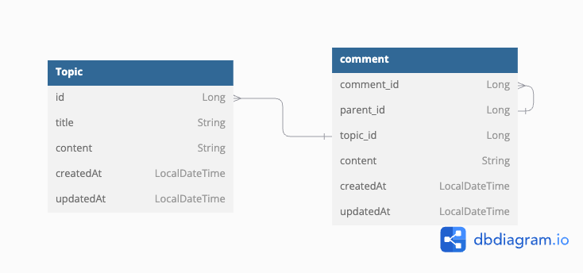

# SeungChanLee  

봄이 오기 전에 

---

# 스터디
[스터디 링크](https://swift-pastry-05e.notion.site/3-d56a7fba8a8548b2bac84e4d301838cf)

---

# 0주차 과제 
### 환경 세팅
### 자바 기본 문법
[자바 정리 문서 보기](https://seemly-fuchsia-ae4.notion.site/0916843fca8a431ea718eb2af3644278)
### sql정리
[SQL 정리 문서 보기](https://seemly-fuchsia-ae4.notion.site/Database-945b7e0734b64913ad4861f2e6776f15)

---

# 1주차 세션
### 자바 객체지향프로그래밍

# 1주차 과제 
### 자바 객체지향으로 게임 만들기
[프로젝트 설명](https://seemly-fuchsia-ae4.notion.site/1-593da81e48184ab2b7a92d638b4d1e75?pvs=25)

---

# 2주차 실습 및 과제
### 스프링 부트 CRUD
[실습및 과제 정리](https://seemly-fuchsia-ae4.notion.site/2-101dbf7eb0078045ab0ed64d0111e7d0?pvs=25)

---

# 3주차 실습 및 과제
### 응답 규격화와 패키지 구조
[정리한 내용](https://seemly-fuchsia-ae4.notion.site/3-109dbf7eb007802b9070d4639f03ab8d)
[컨벤션 정리 내용](https://seemly-fuchsia-ae4.notion.site/109dbf7eb007807b8bd5e4d27b29fee3?pvs=74)