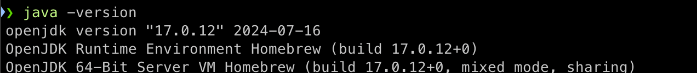

### Homebrew를 통해 Java 17 설치하기

1. 자바 설치
    ```bash
    brew install openjdk@17
    ```

2. Java 설치 경로 확인
    ```bash
    brew --prefix openjdk@17
    ```

3. 1. 환경 변수 설정
    ```bash
    nano ~/.zshrc
    ```

    2. 나노 편집기에서 마지막에 아래 내용 삽입
    ```bash
    export JAVA_HOME=[찾은 경로]
    export PATH="$JAVA_HOME/bin:$PATH"
    ```

    3. 파일 저장 및 종료
   - 파일 저장: `Control + O`
   - 파일 수정 종료: `Control + X`

    4. 변경 사항 적용
    ```bash
    source ~/.zshrc
    ```



### Homebrew를 통해 IntelliJ IDEA 설치하기

IntelliJ IDEA
> JetBrains에서 개발한 **통합 개발 환경(IDE)** 
이 IDE는 Java를 비롯한 다양한 프로그래밍 언어와 프레임워크를 지원하며, 코드 작성, 디버깅, 테스트 등을 통합적으로 관리할 수 있도록 도와줍니다.

```bash
brew install --cask intellij-idea-ce
```


### h2 다운

H2는 Java로 작성된 오픈 소스 관계형 데이터베이스 관리 시스템(RDBMS)입니다. 주로 다음과 같은 특성을 가지고 있습니다:

	1.	가벼움과 내장형 데이터베이스: H2는 매우 가벼워서 자바 애플리케이션에 쉽게 내장할 수 있습니다. 따라서 개발 및 테스트 환경에서 많이 사용되며, 임베디드 모드로 작동하여 애플리케이션과 동일한 프로세스 내에서 데이터베이스를 실행할 수 있습니다.
	2.	인메모리 데이터베이스 지원: H2는 인메모리 모드를 지원하므로, 데이터가 메모리에 저장되어 매우 빠른 읽기/쓰기 성능을 제공합니다. 이 모드는 일시적인 데이터 저장이나 테스트 용도로 자주 사용됩니다.
	3.	JDBC 호환: H2는 Java Database Connectivity (JDBC) 인터페이스를 완벽하게 지원합니다. 이는 Java 애플리케이션이 SQL 기반 데이터베이스와 통신하는 표준 방법이므로, H2를 사용하는 개발자들은 JDBC를 통해 쉽게 데이터베이스와 상호작용할 수 있습니다.
	4.	크로스-플랫폼: Java로 작성되었기 때문에, H2는 Windows, MacOS, Linux 등 다양한 운영 체제에서 실행될 수 있습니다.
	5.	오픈 소스: H2는 오픈 소스 소프트웨어로, 누구나 자유롭게 사용하고 수정할 수 있습니다.

실행 명령어

```bash
./h2.sh
```

### Homebrew를 통해 postgresql 설치하기

1. **PostgreSQL 설치**: 

   ```bash
   brew install postgresql
   ```

2. **PostgreSQL 시작**: 

   ```bash
   brew services start postgresql
   ```

4. **PostgreSQL 버전 확인**: 

   ```bash
   psql --version
   ```

5. **기본 설정**: 

   ```bash
   psql postgres
   ```


### 포스트맨
